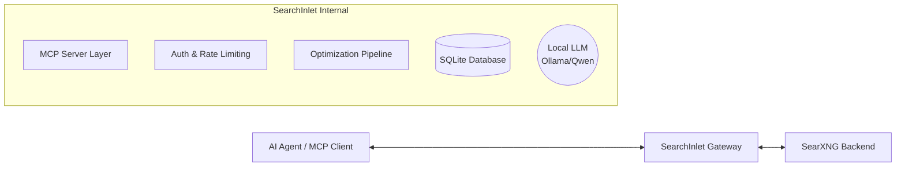

# SearchInlet 🌊

**SearchInlet** is a high-performance, self-hosted **MCP (Model Context Protocol)** Gateway for **SearXNG**. It provides AI Agents with a secure, LLM-optimized interface for searching the internet, featuring advanced distillation, token management, and simple access control.

---

## 🚀 Key Features

*   **MCP Native:** Built using the official Go MCP SDK for seamless integration with Claude Desktop, Cursor, and other AI Agents.
*   **SearXNG Powered:** Aggregates results from 70+ search engines while maintaining privacy.
*   **LLM Optimized:** 
    *   **Sanitization:** Strips boilerplate, HTML, and scripts for clean context.
    *   **Truncation:** Token-aware trimming using `tiktoken` to fit your model's context window.
    *   **Local Distillation:** (WIP) Intelligent relevance scoring and snippet extraction using local Ollama models (e.g. Qwen, Llama).
*   **Self-Hosted Utility:** Designed to be run on your own VPS. Includes a simple Admin UI for generating access tokens and setting basic rate limits (SQLite-backed).
*   **High Performance:** Written in Go for low-latency concurrent processing.

---

## 🛠 Architecture

SearchInlet acts as a bridge between your AI Agent and a local search backend.



Detailed architecture can be found in [docs/Architecture.md](docs/Architecture.md).

---

## 📅 Roadmap & Phases

The project is being developed in three primary phases:

1.  **[Phase 1: Core Foundation](docs/Phase1-Core.md)** - Basic MCP gateway, SearXNG client, and sanitization logic. (✅ Completed)
2.  **[Phase 2: Access Control & Admin Layer](docs/Phase2-AccessControl.md)** - SQLite DB, Token generation, SSE transport, and simple Admin UI.
3.  **[Phase 3: Local Distillation](docs/Phase3-Distillation.md)** - Advanced context optimization using small local LLMs via Ollama.

---

## 🏃 Quick Start (Linux / Server Deployment)

### Prerequisites
*   Docker & Docker Compose installed.

### Installation
Deploying the SearXNG backend and building the MCP server takes just one command.

```bash
curl -sSL https://raw.githubusercontent.com/webdunesurfer/SearchInlet/main/install.sh | bash
```

The script will automatically:
1. Clone the repository (if not already downloaded).
2. Generate a secure, random `SEARXNG_SECRET` to protect sessions.
3. Boot a local, privacy-respecting SearXNG instance using Docker.
4. Cross-compile the Go MCP server binary (no local Go installation required).

### Connecting your AI Agent (Cursor / Claude Desktop)

#### Option A: HTTPS / SSE (Recommended)
1.  Log into your dashboard at `https://searchinlet.com`.
2.  Generate an **Access Token**.
3.  Add the following to your Agent's MCP config:

```json
{
  "mcpServers": {
    "searchinlet": {
      "url": "https://searchinlet.com/sse",
      "headers": {
        "Authorization": "Bearer sk-YOUR_TOKEN_HERE"
      }
    }
  }
}
```

#### Option B: SSH Tunnel (Legacy)
If you prefer not to expose the server via HTTPS, you can still connect via SSH:

```json
{
  "mcpServers": {
    "searchinlet": {
      "command": "ssh",
      "args": [
        "vkh@194.163.160.234",
        "SEARXNG_URL=http://localhost:8088/search /home/vkh/SearchInlet/bin/mcp-server-linux"
      ]
    }
  }
}
```

---

## 🧪 Testing with MCP Inspector

You can test the server using the official MCP Inspector:
```bash
npx @modelcontextprotocol/inspector ./bin/mcp-server
```

---

## 📄 License
This project is licensed under the **GNU General Public License v3.0 (GPL-3.0)**.
See the [LICENSE](LICENSE) file for details.
