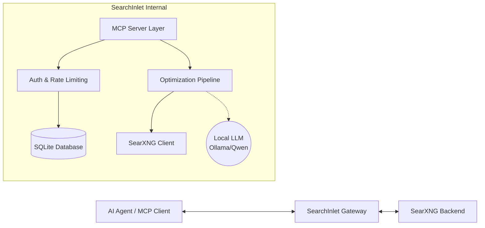

# SearchInlet Architecture

SearchInlet is a high-performance, self-hosted **MCP (Model Context Protocol)** Gateway for **SearXNG**, built in **Go**. It provides AI Agents with a secure, LLM-optimized interface for searching the internet, featuring advanced distillation and token management designed to be run on your own VPS.

---

## 1. System Overview

SearchInlet sits between AI Agents (the MCP Client) and a local SearXNG instance. It translates standard search requests into optimized context, ensuring that Agents receive only the most relevant, sanitized, and token-efficient data without the need for complex, multi-tenant cloud infrastructure.

---

## 2. Core Components

### 2.1 MCP Server Layer (`internal/mcp`)
*   **Standard Interface:** Implements the official MCP specification using `github.com/modelcontextprotocol/go-sdk`.
*   **Transport:** Supports both Stdio (for local execution) and SSE (Server-Sent Events) over HTTP for remote agent connections.
*   **Tools:**
    *   `search(query string, engines []string, limit int)`: Performs a multi-engine search.
    *   `get_page_content(url string)`: Fetches and optimizes content from a specific URL.

### 2.2 Access Control & Security (`internal/auth`)
*   **Token Management:** Static API token generation for authorizing different agents (e.g., "Cursor Token", "CLI Token").
*   **Rate-Limiting:** Simple SQLite or memory-backed rate limiting to prevent run-away agent loops from draining VPS resources.
*   **Admin Dashboard:** A lightweight HTML/HTMX interface to manage tokens and view usage.

### 2.3 SearXNG Client (`internal/searxng`)
*   **REST Integration:** High-concurrency client for the local SearXNG JSON API.

### 2.4 Optimization Pipeline (`internal/optimizer`)
This is the "Brain" of SearchInlet, responsible for making results "LLM-Ready":

1.  **Sanitization:** Strips HTML, JS, CSS, and boilerplate using `bluemonday` and `goquery`.
2.  **Truncation:** 
    *   **Token Counting:** Uses `tiktoken-go` to accurately count tokens.
    *   **Budget Management:** Truncates results to fit within a specified "token budget" provided by the Agent.
3.  **Distillation (Phase 3):** 
    *   *Why use an LLM inside a tool built for LLMs?* When an Agent requests information, raw web scraping can easily return 50,000+ tokens of noisy data. Passing this to a premium model (like GPT-4o or Claude 3.5 Sonnet) is slow, expensive, and dilutes the model's attention.
    *   SearchInlet uses a fast, cheap secondary model (like a local Llama 3 or Qwen via Ollama) as a filter. It reads the massive raw data and extracts only the factual, relevant signals into a dense summary. 
    *   This prevents context-window overflow and dramatically increases the primary Agent's speed and accuracy.

---

## 3. Data Flow

1.  **Request:** The AI Agent connects via SSE or Stdio and calls the `search` tool.
2.  **Authorize:** `internal/auth` validates the provided access token against the SQLite database.
3.  **Fetch:** `internal/searxng` fetches raw results from the local SearXNG instance.
4.  **Optimize:**
    *   `optimizer.Sanitize()`: Removes noise from raw data.
    *   `optimizer.Truncate()`: Ensures the payload fits the token limit.
    *   `optimizer.Distill()`: (Optional) Uses local Ollama model to extract key facts.
5.  **Response:** The MCP Server sends the refined, text-only context back to the Agent.

---

## 4. Key Technologies

*   **Language:** Go 1.24+ (for performance and single-binary deployment).
*   **Database:** SQLite (Zero-setup embedded persistence).
*   **MCP SDK:** `github.com/modelcontextprotocol/go-sdk`.
*   **HTML Processing:** `github.com/PuerkitoBio/goquery` & `github.com/microcosm-cc/bluemonday`.
*   **Tokenization:** `github.com/pkoukk/tiktoken-go`.
