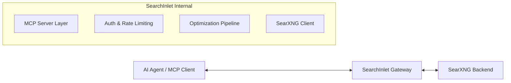

# SearchInlet Architecture

SearchInlet is a high-performance **MCP (Model Context Protocol)** Gateway for **SearXNG**, built in **Go**. It provides AI Agents with a secure, LLM-optimized interface for searching the internet, featuring advanced distillation and token management.

---

## 1. System Overview

SearchInlet sits between AI Agents (the MCP Client) and a SearXNG instance. It translates standard search requests into optimized context, ensuring that Agents receive only the most relevant, sanitized, and token-efficient data.

---

## 2. Core Components

### 2.1 MCP Server Layer (`internal/mcp`)
*   **Standard Interface:** Implements the official MCP specification using `github.com/modelcontextprotocol/go-sdk`.
*   **Tools:**
    *   `search(query string, engines []string, limit int)`: Performs a multi-engine search.
    *   `get_page_content(url string)`: Fetches and optimizes content from a specific URL.
*   **Resources:** Can provide access to saved searches or specific data feeds.

### 2.2 Authentication & Security (`internal/auth`)
*   **API Key Management:** Simple header-based authentication for the MCP gateway.
*   **Request Validation:** Ensures search queries are safe and within bounds.
*   **Privacy-First:** By leveraging SearXNG, SearchInlet inherits its privacy features (no user tracking, proxying requests).

### 2.3 SearXNG Client (`internal/searxng`)
*   **REST Integration:** High-concurrency client for the SearXNG JSON API.
*   **Failover Logic:** Supports multiple SearXNG backend instances for high availability.
*   **Engine Control:** Allows fine-grained control over which search engines (Google, Bing, DuckDuckGo, etc.) are queried.

### 2.4 Optimization Pipeline (`internal/optimizer`)
This is the "Brain" of SearchInlet, responsible for making results "LLM-Ready":

1.  **Sanitization:** Strips HTML, JS, CSS, and boilerplate using `bluemonday` and `goquery`.
2.  **Distillation:** 
    *   **Snippet Ranking:** Scores and re-ranks snippets based on query relevance.
    *   **Context Extraction:** Identifies and extracts key facts or entities.
3.  **Truncation:** 
    *   **Token Counting:** Uses `tiktoken-go` to accurately count tokens for various LLM models (GPT-4, Claude 3, etc.).
    *   **Budget Management:** Truncates results to fit within a specified "token budget" provided by the Agent.

---

## 3. Data Flow

1.  **Request:** The AI Agent calls the `search` tool via the MCP protocol (StdIO or SSE).
2.  **Authorize:** `internal/auth` validates the request.
3.  **Fetch:** `internal/searxng` fetches raw results from the backend.
4.  **Optimize:**
    *   `optimizer.Sanitize()`: Removes noise from raw data.
    *   `optimizer.Distill()`: Selects the most relevant pieces of information.
    *   `optimizer.Truncate()`: Ensures the final payload fits the token limit.
5.  **Response:** The MCP Server sends the refined, text-only context back to the Agent.

---

## 4. Key Technologies

*   **Language:** Go 1.22+ (for performance and concurrency).
*   **MCP SDK:** `github.com/modelcontextprotocol/go-sdk`.
*   **HTML Processing:** `github.com/PuerkitoBio/goquery` & `github.com/microcosm-cc/bluemonday`.
*   **Tokenization:** `github.com/pkoukk/tiktoken-go`.
*   **Logging/Metrics:** Standard `slog` (structured logging).

---

## 5. Future Roadmap

*   **Local Distillation:** Integrate a small local model (e.g., using `ollama` or `llama.cpp`) to summarize search results before passing them to the primary LLM.
*   **WebScraper:** Add a high-performance web scraper to follow links from search results and extract full page content.
*   **Caching:** Redis-backed caching for frequent search queries to reduce backend load.
