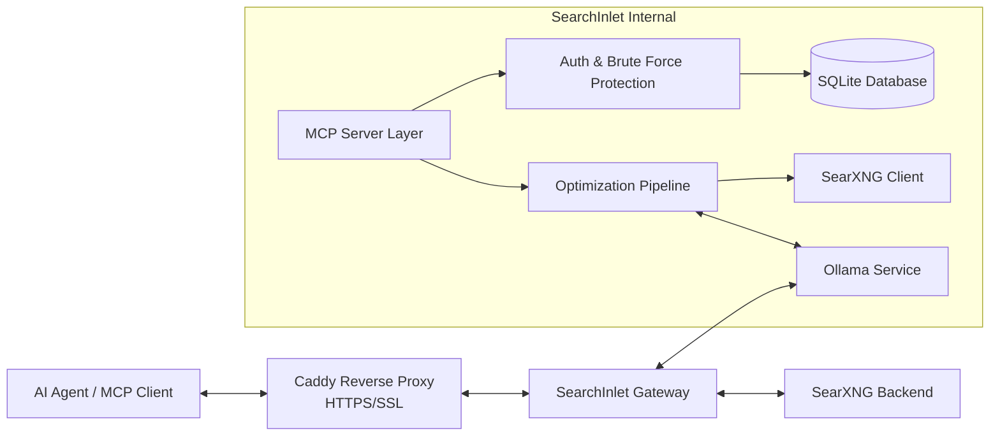

# SearchInlet Architecture

SearchInlet is a high-performance, self-hosted **MCP (Model Context Protocol)** Gateway for **SearXNG**, built in **Go**. It provides AI Agents with a secure, LLM-optimized interface for searching the internet, featuring advanced distillation and token management designed to be run on your own VPS.

---

## 1. System Overview

SearchInlet sits between AI Agents (the MCP Client) and a local SearXNG instance. It translates standard search requests into optimized context, ensuring that Agents receive only the most relevant, sanitized, and token-efficient data without the need for complex, multi-tenant cloud infrastructure.

---

## 2. Core Components

### 2.1 MCP Server Layer (`internal/mcp`)
*   **Standard Interface:** Implements the official MCP specification using `github.com/modelcontextprotocol/go-sdk`.
*   **Transport:** Supports both Stdio (for local execution) and SSE (Server-Sent Events) over HTTP for remote agent connections.
*   **Tools:**
    *   `search(query string, engines []string, limit int)`: Performs a multi-engine search.

### 2.2 Access Control & Security (`internal/auth`)
*   **Token Management:** Static API token generation (SHA-256 hashed) for authorizing different agents.
*   **Rate-Limiting:** SQLite-backed rate limiting to prevent run-away agent loops.
*   **Admin Dashboard:** A responsive HTML interface to manage tokens, global settings, and LLM models.

### 2.3 SearXNG Client (`internal/searxng`)
*   **REST Integration:** High-concurrency client for the local SearXNG JSON API with multi-backend failover.

### 2.4 Optimization Pipeline (`internal/optimizer`)
*   **Sanitization:** Strips HTML, JS, CSS, and boilerplate using `bluemonday` and `goquery`.
*   **Truncation:** 
    *   **Token Counting:** Uses `tiktoken-go` to accurately count tokens.
    *   **Budget Management:** Truncates results to fit within a specified "token budget" provided by the Agent. This ensures that the response is both information-dense and compatible with the Agent's context window.

### 2.5 Distillation Layer (`internal/distiller`)
*   **Local LLM Integration:** Uses **Ollama** as a local inference engine.
*   **Intelligence:** Summarizes and extracts high-density factual signals from noisy search results. When enabled, it transforms raw snippets into a concise summary using models like **Qwen 2.5**.
*   **Efficiency:** By performing local distillation, SearchInlet reduces the total token count by 10x or more before sending data to expensive cloud models like GPT-4, dramatically increasing speed and reducing costs.
*   **Model Management:** Supports background pulling (with progress tracking) and removal of models directly from the admin dashboard.

---

## 3. Data Flow

1.  **Request:** The AI Agent connects via SSE or Stdio and calls the `search` tool.
2.  **Authorize:** `internal/auth` validates the provided access token.
3.  **Fetch:** `internal/searxng` fetches raw results from the local SearXNG instance.
4.  **Optimize:**
    *   `optimizer.Sanitize()`: Removes noise from raw data.
    *   `optimizer.Truncate()`: Ensures the payload fits the token limit.
    *   `distiller.Distill()`: (Optional) Uses local Ollama model to summarize key facts.
5.  **Response:** The MCP Server sends the refined, distilled context back to the Agent.

---

## 4. Key Technologies

*   **Language:** Go 1.24+ (for performance and single-binary deployment).
*   **Database:** SQLite (Zero-setup embedded persistence).
*   **MCP SDK:** `github.com/modelcontextprotocol/go-sdk`.
*   **HTML Processing:** `github.com/PuerkitoBio/goquery` & `github.com/microcosm-cc/bluemonday`.
*   **Tokenization:** `github.com/pkoukk/tiktoken-go`.
